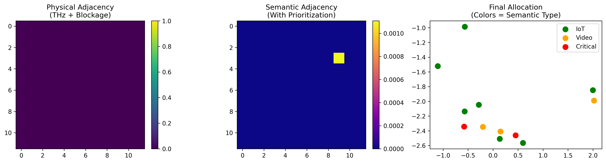

# S-EB-GNN: Semantic Energy-Based GNN for 6G

[](https://github.com/sponsors/antonio-marlon)

A lightweight framework for **semantic-aware resource allocation in THz/RIS-enabled 6G networks**.

## Features
- Physics-based THz channel modeling (path loss, blockage)
- Reconfigurable Intelligent Surfaces (RIS) support
- Semantic prioritization (Critical > Video > IoT)
- Energy-based optimization with negative energy convergence

## Demo


## Get Started
```bash
pip install jax equinox matplotlib
python demo_semantic.ipynb
